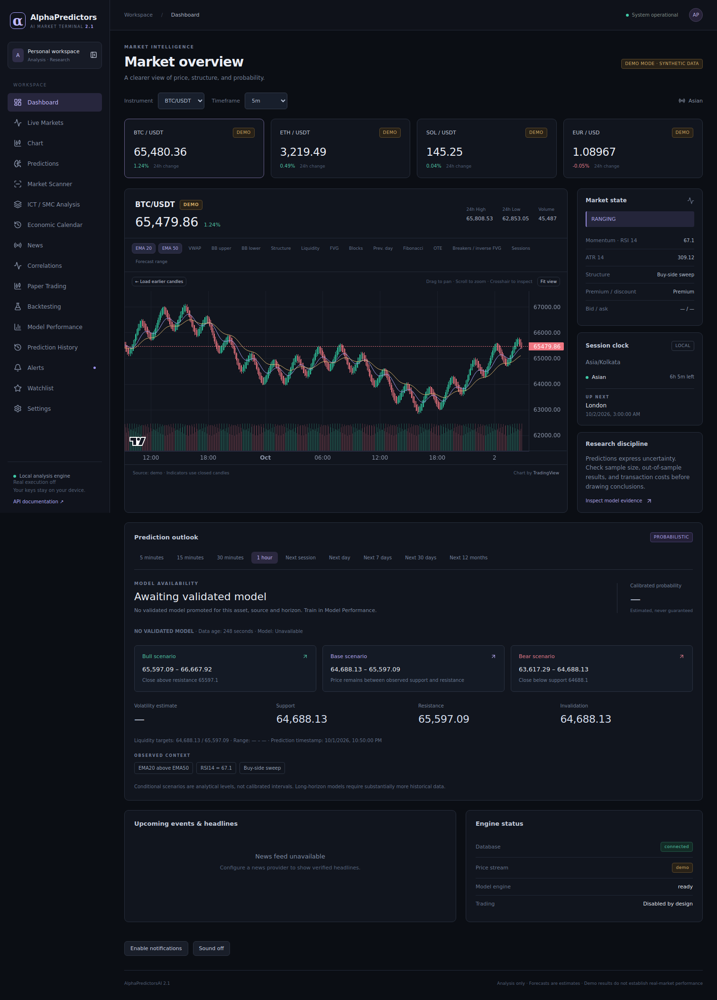

# AlphaPredictorsAI 2.2.0

A runnable local market research terminal with live Binance charts, causal technical analysis, ICT/SMC zones, validated ML forecasts, backtesting and a persistent paper-trading desk.

**Predictions are probabilistic. No prediction or profit is guaranteed. A model must pass validation before probabilities are shown. Real-money execution is disabled: this project contains no broker order integration.**


The current ML pipeline uses causal-v3 features, multiple model candidates, validation-learned directional/Neutral decision rules, probability calibration, and strict chronological holdout evaluation. It never fabricates an 80–90% accuracy claim; weak separation is surfaced as low confidence instead.



## 1. Requirements

- Windows 10/11, 64-bit Python **3.10–3.13**, and Node.js **22 or later**. Python 3.12 is the tested version.
- Add Python and Node.js to PATH during installation; restart your terminal afterward.
- Internet access for the initial dependency installation and live provider connections.
- Ports **5173** and **8000** must be free.

The final automated runs used Linux. The shared launcher, compiled frontend and server were executed; Windows `.bat`/PowerShell wrappers were reviewed, but a native Windows machine was not available. See [verification](docs/validation_report.md).

## 2. Install and run on Windows

Extract `AlphaPredictorsAI-FINAL.zip`. Open the extracted `AlphaPredictorsAI` folder in VS Code or File Explorer. Run:

```powershell
.\setup.bat
.\run.bat
```

Setup creates `.venv`, installs dependencies, builds the frontend, copies `backend/.env.example` to `backend/.env` only if absent, and applies non-destructive database migrations. It reports dependency, build and occupied-port errors.

Run checks dependencies and ports, starts FastAPI and the compiled Vite preview, waits for readiness, and opens **http://localhost:5173/**. Keep the terminal open; press **Ctrl+C** to stop both processes.

- Application: http://localhost:5173/
- Backend health: http://localhost:8000/health
- Interactive API docs: http://localhost:8000/docs

The release ZIP contains source, configuration templates, tests and documentation. Installed packages, compiled frontend assets, databases, credentials, caches and trained binary models are deliberately excluded; setup or Docker builds the frontend deterministically. The first setup needs internet access. Run setup again after changing dependencies or frontend source.

Linux/macOS:

```bash
bash scripts/setup.sh
bash scripts/run.sh
```

## 3. Use the demo (optional)

The default `MOCK_MODE=false` uses **live provider data**. For a deterministic local demonstration, explicitly set `MOCK_MODE=true`; demo data is always clearly labeled DEMO.

1. Open **Dashboard**; the default forecast is the 15-minute horizon with live market data.
2. Open **Chart** to change instrument/timeframe and toggle only the core chart layers.
3. Open **Predictions** for the 5m/15m/30m/1h probabilistic outlook. Review validation and held-out results. Rejection is a valid result.
3. If promoted, open **Predictions → 1 hour**, then enable **Forecast range** on the chart. Demo model performance does not establish live-market performance.
4. Open **Backtesting**, set fees, slippage, spread and position sizing, then run the selected fixed strategy.
5. Open **Paper Trading**, set a virtual balance before the first fill, choose Long/Short, quantity, stop and target. Preview, review and explicitly confirm. Close through the confirmation dialog or let observed prices trigger SL/TP.
6. Add instruments to **Watchlist** and configure **Alerts**. Enable browser notification/sound if wanted.

## 4. Live crypto and forex

Edit `backend/.env`, then restart the application:

```dotenv
MOCK_MODE=false
FOREX_API_KEY=
NEWS_API_KEY=
CALENDAR_API_KEY=
DISPLAY_TIMEZONE=Asia/Kolkata
API_TOKEN=
```

**Binance public spot REST and WebSocket data require no account key.** Configured pairs: BTCUSDT, ETHUSDT, SOLUSDT and XRPUSDT. Region/network restrictions can still prevent access. Live connection failures remain errors; they never silently become synthetic prices.

Forex uses **Twelve Data** for EURUSD, GBPUSD, USDJPY, AUDUSD, USDCAD and USDCHF. Set `FOREX_API_KEY` to your own key with the required history/subscription entitlement. If streaming is unavailable, the adapter explicitly switches to real REST polling, not demo data. Freshness and errors are reported. Volume/bid/ask remain unavailable when the provider does not supply them. Live forex verification is **BLOCKED without credentials**; adapter parsing and REST fallback are locally tested.

Live/demo predictions, models and paper accounts are separated by source. Restarting in another mode does not convert an existing synthetic account or model into a live-data account/model.

## 5. Calendar and news

**Economic Calendar:** `CALENDAR_API_KEY` is a Trading Economics key with calendar access. The screen shows provider event names, country/currency, impact, local time, countdown, forecast/previous/actual and original source. It caches responses for five minutes and labels cached data stale after a failure. Source-specific event coverage depends on the plan. Missing keys show a clear blocked state, with no invented releases.

**News:** `NEWS_API_KEY` is a NewsAPI.org key. Headlines include source, publication time and original link. Related assets use an explicitly labeled headline keyword match. Sentiment and impact are not fabricated. News and calendar are independent integrations; neither was live-tested without credentials.

## 6. Charts, ICT/SMC and sessions

Nine chart timeframes: 1m, 5m, 15m, 30m, 1h, 4h, 1d, 1w, 1M. Candles/volume stream, history loads on demand, and native chart primitives redraw zones under pan and zoom.

Filled layers include FVG/order blocks, mitigation annotations, historical inverse-FVG/breaker transitions, current OTE and liquidity areas, session shading and validated forecast ranges. Structure markers include HH/HL/LH/LL, BOS/CHoCH/MSS, displacement and session sweeps. Toggle layers individually to avoid clutter.

Signals and features use closed candles. Confirmed swings appear only after three confirming bars. Zone creation/transition boundaries use confirmation timestamps. Current OTE/liquidity zones are snapshots, not backdated trade signals. Historical zone transitions are labeled historical; these operational definitions are not a universal ICT interpretation.

Asian, London and New York sessions use source-market civil time and DST rules, displayed by default in Asia/Kolkata. Historical tables include open/high/low/range/return and complete/partial coverage. Weekdays are modeled; local holidays are not. See [sessions](docs/sessions.md) and [ICT definitions](docs/ict_smc.md).

## 7. ML training and prediction

Each **source + asset + timeframe + horizon** has an independent model identity. Supported targets: 5m, 15m, 30m, 1h, next session, day, week, month and year. Day/week/month/year mean rolling 1/7/30/365-day targets, not calendar-end targets.

Train from **Model Performance**, or:

```powershell
.\.venv\Scripts\python.exe scripts\train.py --symbol BTCUSDT --horizon 1h --bars 3000
```

Next-session training uses hourly history and a 96-bar embargo; use at least 10,000 bars. Long horizons need substantially more history. Insufficient samples or missing classes cause rejection/unavailability. A supported target does not imply a usable validated model exists for it.

The pipeline separates chronological train/calibration/validation/test periods, fits preprocessing on training only, purges overlapping labels, calibrates probabilities separately, and selects/promotes using validation only. The test set does not decide promotion. Existing incumbents require a wholly later comparison window. Diagnostic walk-forward folds and feature permutation importance are retained.

Metrics include accuracy, macro precision/recall/F1, ROC-AUC when all classes exist, log loss, Brier score, calibration error, confusion matrix and regression MAE. Paper/strategy performance is reported separately from classification performance. See [ML pipeline](docs/ml_pipeline.md).

A valid prediction reports probability, expected return/high/low/volatility, context levels, model version and timestamp. Forecast bands are estimates, not guaranteed coverage intervals. When no model passes, the app shows **No validated model** and withholds ML probabilities. The latest real Binance validation run was rejected; exact measured results are in [verification](docs/validation_report.md).

Optional XGBoost/LightGBM/CatBoost candidates require `backend/requirements-boosters.txt`. The default two-model pipeline has no dependency on them.

## 8. Backtesting

Three executable strategies: EMA crossover, structure breaks and RSI mean reversion. Signals form on the previous closed bar; entry is at the next open. Fees, adverse slippage and optional spread apply, with fixed-risk or fixed-unit sizing and no leverage. Stops win when a bar touches both stop and target. Gaps can worsen fills.

The lab reports trades, equity/drawdown, return, win rate, profit factor, expectancy, daily Sharpe/Sortino when enough observations exist, and chronological evaluation windows. The 60/40 research/holdout split plus three forward holdout windows evaluate a **fixed user-selected strategy**; they do not perform optimization or adaptive retraining. Each segment resets positions/capital and retains prior-bar feature warmup. UI history is capped at 1,000 bars. Partial exits, funding, borrow costs and exchange queue simulation are not implemented.

## 9. Paper trading

Only virtual market orders are implemented. A preview expires after 30 seconds and must be explicitly confirmed. Confirmation requires a fresh quote, valid bracket levels, sufficient available collateral and no more than 50 bps price drift. Duplicate confirmations cannot create duplicate positions.

Accounts are separate per source and quote currency (for example USDT versus JPY). There is no currency conversion or leverage. Entry/exit fees and slippage affect net P&L. The persistent ledger contains previews/fills, open positions, closed trades, equity, drawdown and statistics. Starting balance changes are allowed only before the first filled trade.

A background worker marks positions every ten seconds and triggers SL/TP from observed quotes. Keep the backend running. Offline missed touches are not reconstructed; stop prices are not guaranteed. Position quote timestamps remain visible so stale marks can be recognized. No code sends real orders.

## 10. Alerts

Price, BOS/CHoCH/MSS/FVG/sweeps, session sweeps, session open, one-hour prediction probability/direction changes, model status changes and upcoming high-impact calendar events are supported. Calendar alerts require credentials. Repeating rules use cooldown and event/transition de-duplication; one-shot is the default. Add the instrument to Watchlist for background monitoring.

The collector runs once per minute. Notifications persist in-app. Browser notifications and sound require explicit opt-in and an open workspace; initial old notifications are not replayed. Email/Telegram/Discord and reliable high-impact headline classification are not included.

## 11. Authentication, storage and operations

Blank `API_TOKEN` keeps localhost setup simple. Set a long random token to require login. Authenticated API access uses a Bearer token or signed HttpOnly/SameSite cookie. WebSockets enforce authentication and allowed origins. Login attempts and HTTP requests are rate-limited. Tokens stay out of frontend source, logs and saved ZIPs. Rotate `API_TOKEN` to invalidate issued cookies. See [security](docs/security.md).

SQLite initializes automatically under `data/alpha.db`; migration 0002 adds paper accounts/audit records without dropping existing predictions/settings. Stop the backend before making a backup of `data/` and `models/`. Never load untrusted joblib artifacts.

For PostgreSQL install `backend/requirements-postgres.txt` and set `DATABASE_URL=postgresql+psycopg://...`. SQLAlchemy/Alembic and account locking support that engine, but PostgreSQL runtime verification is **BLOCKED without a provisioned server**.

This is a local single-user research application. It is not a hosted multi-user service, audited broker, uptime SLA or public production deployment.

## 12. Docker deployment

The project includes a two-container Docker Compose deployment:

- `backend`: FastAPI, database/migrations, ML and market-data services on port 8000.
- `frontend`: production Vite build served by nginx on port 5173, proxying API, health, docs and WebSocket traffic to the backend.

For a clean checkout:

```bash
cp backend/.env.example backend/.env
docker compose up --build
```

Then open `http://localhost:5173/`. The backend remains available at `http://localhost:8000/health` and `http://localhost:8000/docs`.

For a real deployment, set `MOCK_MODE=false`, configure the required provider credentials, set a strong `API_TOKEN`, restrict `CORS_ORIGINS`, and place the stack behind HTTPS. The application never converts a provider failure into synthetic live data.

## 13. Tests and development

```powershell
.\.venv\Scripts\python.exe -m pytest backend\tests -q
cd frontend
npm test
npm run build
cd ..
.\.venv\Scripts\python.exe -m pip install -r backend\requirements-test.txt
.\.venv\Scripts\python.exe -m playwright install chromium
.\.venv\Scripts\python.exe tests\browser_smoke.py
.\.venv\Scripts\python.exe tests\completion_browser.py
.\.venv\Scripts\python.exe tests\production_browser.py
.\.venv\Scripts\python.exe tests\live_browser_smoke.py
```

Browser scripts start isolated temporary databases; close running servers first. The live script requires reachable Binance public services. To edit frontend source with hot reload, run the backend on port 8000 and `npm run dev` from `frontend/` instead of the packaged launcher.

Final results, screenshots and limitations are in [validation report](docs/validation_report.md). Source distribution hashes are recorded in `MANIFEST.sha256` inside the ZIP.

## 14. Troubleshooting

| Symptom | Action |
|---|---|
| Python/Node not found | Install the required versions, enable PATH, restart the terminal, rerun setup. |
| Port occupied | Stop the previous AlphaPredictorsAI window; the launcher identifies the conflicting port. |
| Build or dependency error | Read the exact console error, check internet access, rerun setup. Do not edit source to bypass errors. |
| UI unavailable | Check http://localhost:8000/health and the launcher console. Both services must be running. |
| Live provider unavailable | Check network/region, configured key and provider plan. The app does not substitute demo data. |
| No predictions | Train the exact asset/source/horizon and inspect the promotion gate and sample count. Rejection intentionally withholds probabilities. |
| Expired paper preview | Request a fresh preview and review the current price before confirmation. |
| Insufficient virtual balance | Reduce quantity/risk; the full notional is collateralized. |
| No notification | Add the asset to Watchlist, keep the backend running, allow browser notifications and wait for a qualifying new event. |
| Login required | Use your configured API_TOKEN. Edit the backend environment and restart to change it. |

See [scope](docs/scope.md) for the complete PASS/PARTIAL/BLOCKED feature table. Missing credentials are never treated as successful live verification.

## 2.2 production signal layer

The prediction API now separates the **raw ML model direction** from the **tradable signal decision**. A calibrated classifier may estimate Bullish/Bearish/Neutral internally, but the public signal layer returns `LONG`, `SHORT`, or `NO-TRADE` after independent probability, separation, expected-return and minimum-R:R gates. Weak or ambiguous model output is therefore explicitly abstained rather than presented as a trade.

Signal levels include entry, stop loss, take profit, R:R, signal probability, model direction, signal confidence and a machine-readable reason. Thresholds are configurable through `backend/.env` / `.env.example`.

For public deployment, configure a strong `API_TOKEN`, restrict `CORS_ORIGINS` to the exact frontend origin, use HTTPS, and provision persistent storage. Real-money execution remains disabled by design.
